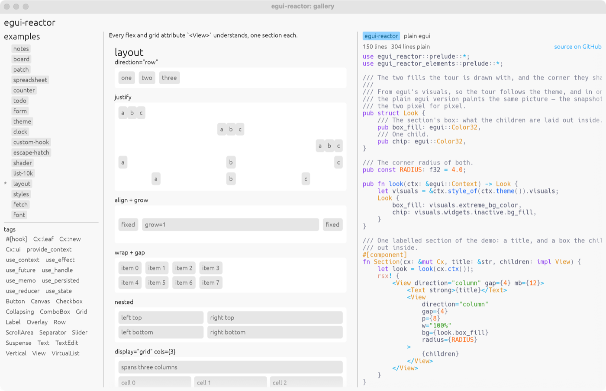

# react-egui

react-egui is a Rust library for writing [egui](https://github.com/emilk/egui) applications the way you write React: a JSX-like `rsx!` macro, function components with `#[component]`, and hooks such as `use_state` and `use_effect`. Because egui is immediate mode there is no retained tree and no reconciler, so event handlers run where they are written and can borrow local state with `&mut` — none of the `'static` closures, `Rc<RefCell<_>>` or `.clone()` ceremony that retained-mode Rust UI frameworks require. Flexbox and Grid layout are first-class through [egui_taffy](https://github.com/PPakalns/egui_taffy).

Design decisions are recorded in [docs/ARCHITECTURE.md](docs/ARCHITECTURE.md).

## Usage

```rust
use react_egui::prelude::*;
use react_egui_app::{Options, run};
use react_egui_elements::prelude::*;

#[component]
pub fn App(cx: &mut Cx) {
    let mut count = use_state(cx, || 0i32);

    rsx! {
        <View direction="column" align="center" justify="center" gap={12} grow={1.0}>
            <Text size={32.0} strong>{format!("{}", *count)}</Text>
            <View direction="row" gap={8}>
                <Button on_click={|| *count -= 1}>"-"</Button>
                <Button on_click={|| *count = 0}>"reset"</Button>
                <Button on_click={|| *count += 1}>"+"</Button>
            </View>
        </View>
    }
}

fn main() -> eframe::Result {
    run(
        Options {
            title: String::from("react-egui: counter"),
            ..Default::default()
        },
        // Hooks belong in components, so that a view can borrow their guards;
        // the root closure's `Cx` is normally unused.
        |_cx| rsx! { <App/> },
    )
}
```

That is the `counter` example: the component is [`examples/counter/src/lib.rs`](examples/counter/src/lib.rs) and the `run(..)` call is its [`src/main.rs`](examples/counter/src/main.rs). Each example is a library so that the gallery can embed it and tests can drive it, with a thin binary on top.

Work that spans frames is one `use_future(cx, deps, || async { .. })` returning a `&Poll<T>`; a child waits with `let Poll::Ready(x) = .. else { return };` and the nearest `<Suspense fallback={..}>` draws its fallback until everything below it is ready.

The hooks, the elements and the layout attributes are listed in [docs/ARCHITECTURE.md](docs/ARCHITECTURE.md) sections 4 and 6.

## Examples

Every example runs in the browser in the [gallery](https://fand.github.io/react-egui/), next to its source. Some of them also have a version written with plain egui, so you can switch between the two and compare.



| name | what | live | source | plain egui |
|---|---|---|---|---|
| `counter` | One piece of state, three handlers that borrow it in turn. | [#counter](https://fand.github.io/react-egui/#counter) | [lib.rs](examples/counter/src/lib.rs) | [plain.rs](examples/counter/src/plain.rs) |
| `todo` | A reducer drives the list; `use_persisted` keeps it across restarts. | [#todo](https://fand.github.io/react-egui/#todo) | [lib.rs](examples/todo/src/lib.rs) | [plain.rs](examples/todo/src/plain.rs) |
| `form` | Every bound widget, a change log, and settings that survive a restart. | [#form](https://fand.github.io/react-egui/#form) | [lib.rs](examples/form/src/lib.rs) | [plain.rs](examples/form/src/plain.rs) |
| `theme` | Two values provided at the top and read three levels down, with nothing in between. | [#theme](https://fand.github.io/react-egui/#theme) | [lib.rs](examples/theme/src/lib.rs) | – |
| `clock` | A stopwatch that asks for its own repaints, and an effect that cleans up after itself. | [#clock](https://fand.github.io/react-egui/#clock) | [lib.rs](examples/clock/src/lib.rs) | – |
| `custom-hook` | Three hooks of your own, each called from two components that keep their own state. | [#custom-hook](https://fand.github.io/react-egui/#custom-hook) | [lib.rs](examples/custom-hook/src/lib.rs) | – |
| `escape-hatch` | Four ways down to plain egui: a closure, a leaf, a painter, and a nested Cx. | [#escape-hatch](https://fand.github.io/react-egui/#escape-hatch) | [lib.rs](examples/escape-hatch/src/lib.rs) | – |
| `layout` | Every flex and grid attribute `<View>` understands, one section each. | [#layout](https://fand.github.io/react-egui/#layout) | [lib.rs](examples/layout/src/lib.rs) | [plain.rs](examples/layout/src/plain.rs) |
| `fetch` | `use_future` runs the request; the nearest `<Suspense>` draws the spinner. | [#fetch](https://fand.github.io/react-egui/#fetch) | [lib.rs](examples/fetch/src/lib.rs) | – |

Run one natively, or in a browser with [trunk](https://trunkrs.dev/):

```sh
cargo run -p counter
cargo run -p counter --bin counter-plain    # the plain egui version
trunk serve --config examples/counter/Trunk.toml
```

The gallery runs the same way, and takes the name of the example to open first:

```sh
cargo run -p gallery todo
trunk serve --config examples/gallery/Trunk.toml
```

## Testing

```sh
cargo fmt --all --check
cargo clippy --workspace --all-targets -- -D warnings
cargo test --workspace
cargo check --workspace --target wasm32-unknown-unknown
```

Pixel snapshot tests live behind a cargo feature because they need a GPU, and the committed images were rendered on macOS, so they will not match another platform's renderer. They do not run in CI, so regenerate them by hand after any change that alters what they draw.

```sh
cargo test -p react-egui-elements --features snapshot
# Each example drawn twice, react-egui and plain egui, compared with one image:
# if both render the same picture, the only difference is the code.
cargo test -p gallery --features snapshot
```

After an intentional visual change, regenerate on the platform the images came from:

```sh
UPDATE_SNAPSHOTS=1 cargo test -p react-egui-elements --features snapshot
# The gallery's pairs share one file, so write it from the react-egui side
# first and then let the plain egui side check itself against it.
UPDATE_SNAPSHOTS=1 cargo test -p gallery --features snapshot react_egui
cargo test -p gallery --features snapshot
```

## License

Licensed under either of [MIT](LICENSE-MIT) or [Apache-2.0](LICENSE-APACHE) at your option.
