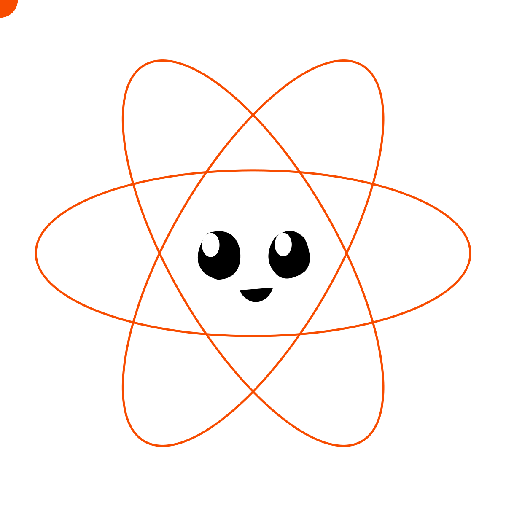

<div align="center">
  
  <h1>egui-reactor</h1>
  <p>Write Rust GUI apps like React!</p>
</div>

egui-reactor is a Rust library for writing [egui](https://github.com/emilk/egui) applications the way you write React: a JSX-like `rsx!` macro, function components with `#[component]`, and hooks such as `use_state` and `use_effect`. Because egui is immediate mode there is no retained tree and no reconciler, so event handlers run where they are written and can borrow local state with `&mut` — none of the `'static` closures, `Rc<RefCell<_>>` or `.clone()` ceremony that retained-mode Rust UI frameworks require. Flexbox and Grid layout are first-class: `<View>` is a node in a small layout engine of our own, written over [taffy](https://github.com/DioxusLabs/taffy).

Documentation: [fand.github.io/egui-reactor](https://fand.github.io/egui-reactor/) — a guide, a reference, and every example running in the browser next to its source.

## Quick start

Add the three crates, plus egui and eframe, to `Cargo.toml`:

```toml
[dependencies]
egui-reactor = "0.1"
egui-reactor-elements = "0.1"
egui-reactor-app = "0.1"
egui = "0.36.1"
eframe = "0.36.1"
```

Put a counter in `src/main.rs`:

```rust
use egui_reactor::prelude::*;
use egui_reactor_app::{Options, run};
use egui_reactor_elements::prelude::*;

#[component]
fn App(cx: &mut Cx) {
    let mut count = use_state(cx, || 0i32);

    rsx! {
        <View direction="column" align="center" justify="center" gap={12} grow={1.0}>
            <Text size={32.0} strong>{format!("{}", *count)}</Text>
            <View direction="row" gap={8}>
                <Button on_click={|| *count -= 1}>"-"</Button>
                <Button on_click={|| *count = 0}>"reset"</Button>
                <Button on_click={|| *count += 1}>"+"</Button>
            </View>
        </View>
    }
}

fn main() -> eframe::Result {
    run(
        Options {
            title: String::from("counter"),
            ..Default::default()
        },
        |_cx| rsx! { <App/> },
    )
}
```

Then run it:

```sh
cargo run
```

`#[component]` makes `App` usable as `<App/>`. `use_state` returns a guard that derefs to the value, so `*count += 1` is the whole API: the three handlers borrow `count` as `&mut` in turn, because each runs during this frame and is dropped right after. `run` opens a window on native and takes over a canvas on wasm. Keep hooks in components rather than the root closure.

The same program runs in a browser with [trunk](https://trunkrs.dev/): add an `index.html` with a `<canvas id="egui_reactor_canvas">` and `trunk serve`. [Getting Started](https://fand.github.io/egui-reactor/getting-started) has the file, and the rest of the site takes it from there:

- [How it works](https://fand.github.io/egui-reactor/how-it-works): what immediate mode changes about React habits.
- [Guide](https://fand.github.io/egui-reactor/guide/rsx): `rsx!`, components and events, state and hooks, layout, async, fonts, escape hatches to plain egui.
- [Reference](https://fand.github.io/egui-reactor/reference/hooks): every hook, element and layout attribute.
- [Examples](https://fand.github.io/egui-reactor/examples/notes): seventeen apps, each running on its page next to its source. Start with `notes`.

## Examples

The examples live in [`examples/`](examples/). Run one natively, or in a browser:

```sh
cargo run -p counter
cargo run -p todo --bin todo-plain          # the plain egui version, where there is one
trunk serve --config examples/counter/Trunk.toml
```

`cargo run -p gallery` opens all of them in one window, with the source next to the running app.


## Development

```sh
cargo fmt --all --check
cargo clippy --workspace --all-targets -- -D warnings
cargo test --workspace
cargo check --workspace --target wasm32-unknown-unknown
```

Pixel snapshot tests need a GPU and the committed images were rendered on macOS, so they run locally only, not in CI:

```sh
cargo test -p egui-reactor-elements --features snapshot
cargo test -p gallery --features snapshot
# after an intentional visual change, on macOS:
UPDATE_SNAPSHOTS=1 cargo test -p egui-reactor-elements --features snapshot
UPDATE_SNAPSHOTS=1 cargo test -p gallery --features snapshot egui_reactor
```

The current design is in [docs/ARCHITECTURE.md](docs/ARCHITECTURE.md); design decisions are in [docs/adr/](docs/adr/).

## License

Licensed under either of [MIT](LICENSE-MIT) or [Apache-2.0](LICENSE-APACHE) at your option.
